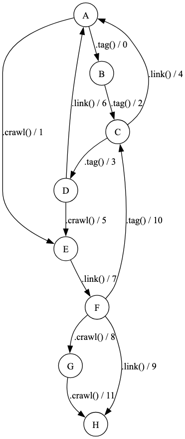

# Задача 11

Реализовать конечный автомат Мили в виде класса. Начальным состоянием автомата является A. Методы возвращают числовые значения.

Если вызываемый метод не реализован для некоторого состояния, необходимо вызвать пользовательское исключение MealyError. При возникновении исключения должно передаваться имя метода, вызвавшего это исключение.

Реализовать в отдельной функции test автоматическое тестирование автомата Мили на основе покрытия ветвей. Требуемая степень покрытия: 100%.



В примерах ниже функция main возвращает объект созданного класса. Далее последовательно вызываются методы полученного объекта.

**Пример 1**

```python
o = main()
o.tag() # 0
o.tag() # 2
o.link() # 4
o.link() # MealyError
o.crawl() # 1
o.tag() # MealyError
o.link() # 7
o.tag() # 10
o.tag() # 3
o.link() # 6
o.crawl() # 1
o.link() # 7
o.tag() # 10
o.tag() # 3
o.crawl() # 5
o.tag() # MealyError
o.link() # 7
o.crawl() # 8
o.crawl() # 11
```